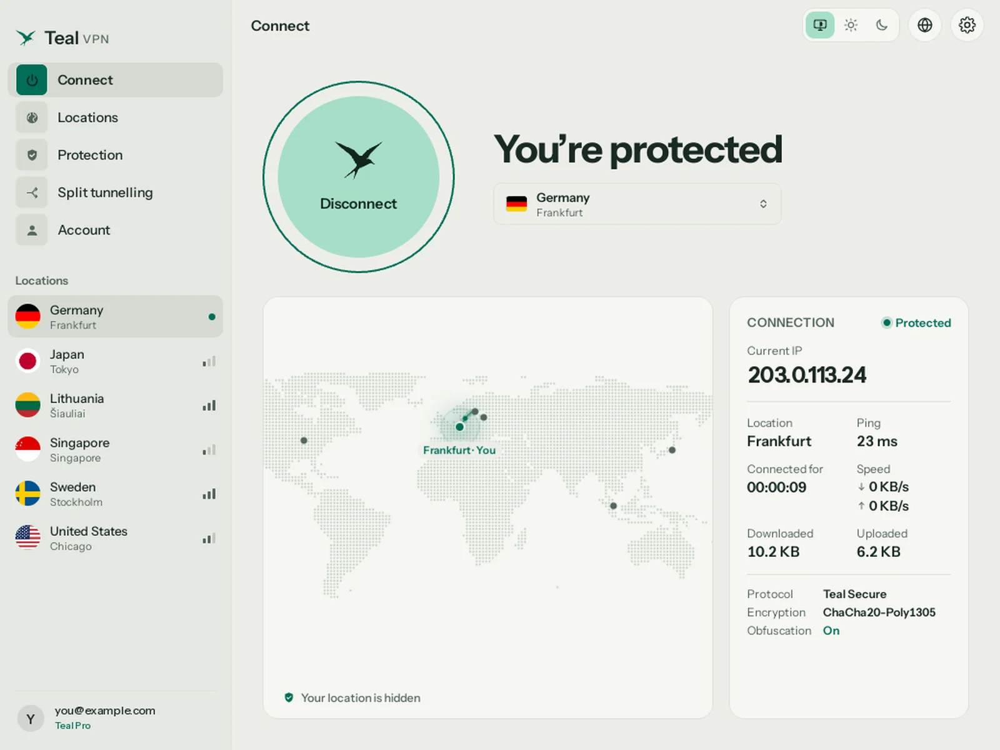
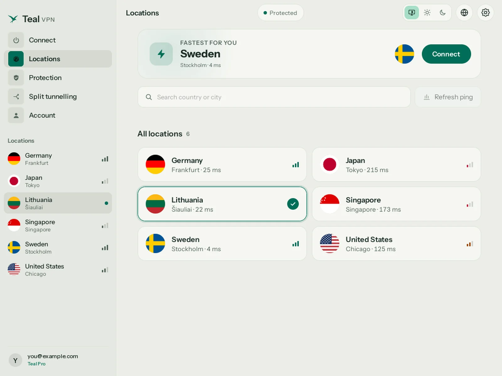
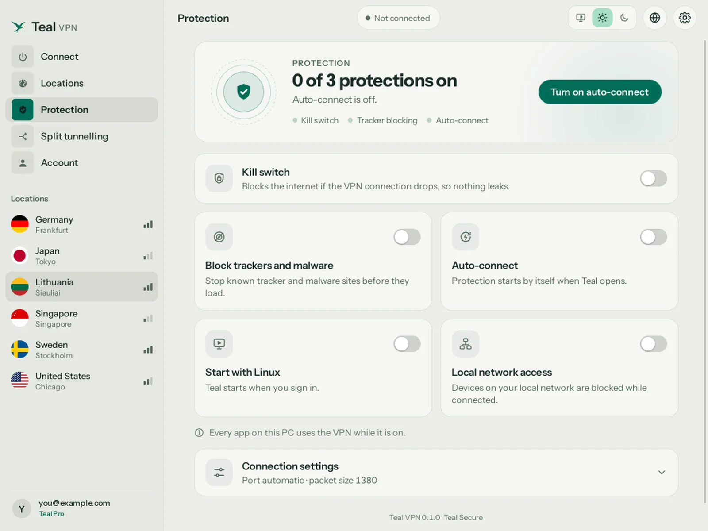

<p align="center">
  
</p>

<h1 align="center">Teal VPN for Linux</h1>
<p align="center">Ubuntu, Debian and other Debian-based Linux, Intel / AMD and ARM.</p>

<p align="center">
  <a href="https://github.com/tealvpn/linux/releases/latest/download/teal-vpn_amd64.deb"></a>
  <a href="https://github.com/tealvpn/linux/releases/latest/download/teal-vpn_arm64.deb"></a>
</p>
<p align="center"><sub>Most PCs: the first button. Raspberry Pi 4/5 and ARM laptops: Linux on ARM.</sub></p>

<p align="center">
  
  
  
</p>

## Install

```
sudo apt install ./teal-vpn_amd64.deb
```

Then open **Teal VPN** from your applications menu, sign in and click **Connect**.

## Check the file

Each release lists the SHA-256 of each package and carries a `.sha256` file:

```
sha256sum -c teal-vpn_amd64.deb.sha256
```

## Updates

The app updates itself and checks a signed list and the SHA-256 before installing an update.

## Official links

[tealvpn.com](https://tealvpn.com/linux) · [Your account](https://account.tealvpn.com) · [All Teal VPN downloads](https://github.com/tealvpn) · support@tealvpn.com

Download Teal VPN only from tealvpn.com, Google Play or this GitHub organization. This repository holds no source code, only the releases.
